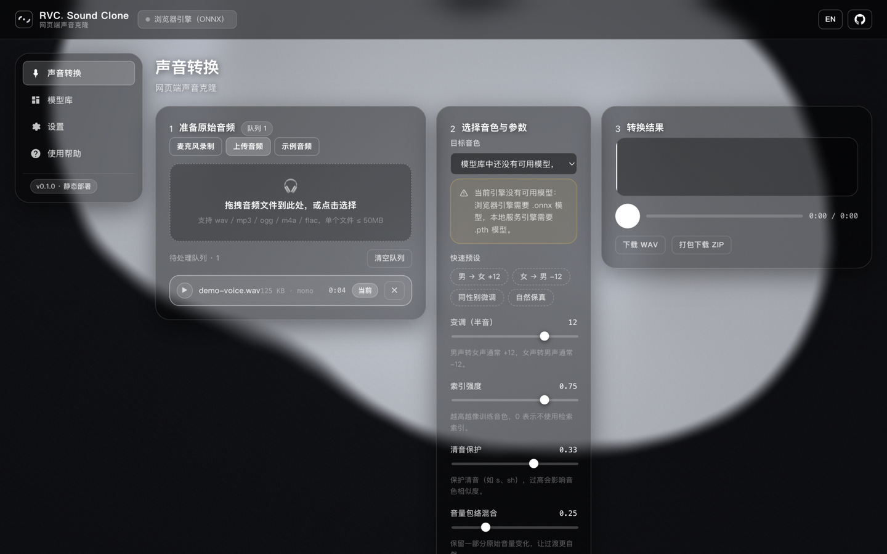

# RVC Sound Clone

> 借助 RVC（Retrieval-based Voice Conversion）实现的**网页端声音克隆 / 变声工具** —— 纯静态部署，录音、上传、推理、导出全在浏览器里完成，音频不上传。也可切换到本地服务引擎，连接本机官方 RVC 服务获得 GPU 级音质与速度。

[](https://forjiang.github.io/rvc-sound-clone/)
[](LICENSE)
[](index.html)
[](https://github.com/ForJiang/rvc-sound-clone/pulls)

English intro at the bottom → [English](#-english)

---

## ✨ 功能特性

| | |
| --- | --- |
| 🎙️ **零安装录音** | 浏览器内直接录音，实时电平条，建议 5–30 秒即可开工 |
| 📂 **批量处理** | 拖入任意多个音频文件排队转换，结果可打包成 ZIP 一次下载 |
| 🧠 **双引擎** | **浏览器引擎**：ONNX Runtime Web 在页内跑完整流水线；**本地服务引擎**：连接本机官方 RVC WebUI |
| 🎚️ **完整参数** | 变调、索引强度、清音保护、音量包络混合、中值滤波半径，全部可调节 |
| ⚡ **快捷操作** | 参数预设一键套用、队列原声试听、键盘快捷键（R 录音 / C 转换 / 空格播放） |
| 📦 **自带模型库** | 基础模型一键下载，自定义 `.onnx` / `.pth` + `.index` 拖拽导入 |
| 🎨 **液态金属视觉** | 深色玻璃面板 + WebGL 液态金属背景 + 鼠标流光，视觉语言对齐 [ForJiang.github.io](https://github.com/ForJiang/ForJiang.github.io) |
| 🌐 **中英双语** | 跟随系统语言，可手动切换，移动端自适应 |
| 🔒 **隐私优先** | 音频与模型只存在你自己的 IndexedDB，没有任何服务端副本 |
| 🚀 **真正静态** | 无构建、无依赖安装，GitHub Pages 直接发布 |

## 🖼️ 界面预览



转换页按「准备原始音频 → 选择音色与参数 → 播放导出」三步排布，右侧结果区可试听、下载 WAV 或打包 ZIP；
四个快速预设（男→女 / 女→男 / 同性别微调 / 自然保真）一键套用常用参数组合，队列支持原声试听。

> 视觉语言参考 [ForJiang.github.io](https://github.com/ForJiang/ForJiang.github.io)：深色单一主题、液态金属 shader 背景、`bg-black/40` 半透明玻璃面板、`rounded-3xl` 圆角、白色主 CTA。背景用自研 WebGL fragment shader 实现（无第三方依赖），并按帧时间自适应画质；`prefers-reduced-motion` 下自动静止。

## 🧩 它是怎么工作的

```
浏览器（纯静态站点）
 ├─ 录音 / 上传 ──► 解码 ──► 重采样 16kHz ──► WAV
 └─ 两种推理路径：
     ├─ 浏览器引擎  hubert.onnx + f0.onnx + speaker.onnx + generator.onnx   （ONNX Runtime Web）
     └─ 本地服务引擎 ──► server/bridge.py ──► 官方 RVC WebUI（:5555）
```

浏览器引擎需要把权重转成 ONNX（仓库内附转换脚本），本地服务引擎直接复用官方 `.pth`，因此两者音质与速度各有取舍：

| | 浏览器引擎 | 本地服务引擎 |
| --- | --- | --- |
| 权重格式 | 4 × ONNX | `.pth` + `.index`（官方格式） |
| 安装成本 | 零 | 需先跑官方 RVC WebUI + 桥接层 |
| 检索索引 | 暂不支持（界面会提示） | 支持 |
| 速度 | 受设备限制（WASM / WebGPU） | GPU 加速，快一个数量级 |
| 隐私 | 完全本地 | 请求只发到 `127.0.0.1` |

设计细节见 [docs/architecture.md](docs/architecture.md)。

## 🚀 快速开始

### 在线使用

打开部署好的页面即可（首次使用需要下载基础模型）。

- **<https://forjiang.github.io/rvc-sound-clone/>**

### 本地运行

```bash
git clone https://github.com/ForJiang/rvc-sound-clone.git
cd rvc-sound-clone
python3 -m http.server 8080
# 打开 http://127.0.0.1:8080
```

> 必须用 `http://` 或 `https://` 打开；`file://` 会被浏览器安全策略拦住。

### 使用本地服务引擎（推荐给重度用户）

```bash
# 1. 启动官方 RVC WebUI 并开启 API（默认监听 :5555）
# 2. 启动桥接层，解决静态页面跨域访问 localhost 的问题
python3 server/bridge.py --port 7865

# 没有安装 RVC 也能先联调：
python3 server/bridge.py --mode echo
```

然后在网页「设置 → 推理引擎 → 本地服务引擎」填 `http://127.0.0.1:7865`，点「测试连接」。

## 📖 使用流程

1. **准备原始音频** —— 麦克风录一段，或拖入 wav / mp3 / flac 等文件。
2. **选择目标音色** —— 模型库里下载基础模型，再导入或下载一个音色模型。
3. **调参** —— 先用默认值跑一次，不满意再动「变调」。
4. **转换与导出** —— 在线试听，下载 WAV 或多个结果打包 ZIP。

参数怎么调：

| 参数 | 作用 | 建议值 |
| --- | --- | --- |
| 变调（半音） | 整体音高平移，男→女 `+12`，女→男 `-12` | 按性别组合定 |
| 索引强度 | 用检索索引逼近训练音色的程度，1 可能机械 | 0.6 ~ 0.8 |
| 清音保护 | 保护 `s / sh / f` 这类清音不被糊掉 | 0.33 |
| 音量包络混合 | 保留原始录音的音量起伏，语气更自然 | 0.2 ~ 0.3 |
| 中值滤波半径 | 平滑音高曲线，减少颤音破音 | 3 |

完整说明：[docs/usage.md](docs/usage.md) ・ 疑难排查：[docs/faq.md](docs/faq.md)

## 🎭 模型从哪来

- **基础模型**（HuBERT / RMVPE）：网页「模型库 → 基础模型」一键下载，来自 RVC 官方预处理模型。
- **音色模型**：仓库不托管任何人声音色。你可以导入社区公开模型，或用官方 [Retrieval-based-Voice-Conversion-WebUI](https://github.com/RVC-Project/Retrieval-based-Voice-Conversion-WebUI) 自己训练（10–20 分钟干净干声即可起步）。
- **网页内使用需 ONNX 版**：用仓库内脚本转换，然后把 4 个 `.onnx` 打包导入。

```bash
pip install torch onnx

# 音色模型 → speaker.onnx + generator.onnx
python3 tools/export_onnx.py --pth weights/MyVoice.pth --out ./MyVoice-onnx

# 基础模型 → hubert.onnx + f0.onnx
python3 tools/export_onnx.py --hubert hubert_base.pt --f0 rmvpe.pt --out ./base-onnx
```

转换脚本与前端 IO 契约的对应关系见 [docs/model-conversion.md](docs/model-conversion.md)。

## 🗂 目录结构

```
rvc-sound-clone/
├─ index.html              单页应用入口（hash 路由）
├─ 404.html
├─ manifest.webmanifest    PWA 元信息
├─ assets/
│  ├─ css/style.css        深色玻璃设计系统、响应式布局
│  ├─ logo.svg
│  └─ js/
│     ├─ app.js            启动引导 + 路由 + 顶栏
│     ├─ state.js          设置、共享状态、引擎工厂
│     ├─ i18n.js           中英文案
│     ├─ ui.js             DOM/toast/模态框/波形/ZIP
│     ├─ audio.js          录音、解码、重采样、WAV 编解码、播放器
│     ├─ store.js          IndexedDB（模型 Blob + 设置）
│     ├─ catalog.js        模型索引
│     ├─ liquid-bg.js     WebGL 液态金属背景 + 鼠标流光
│     ├─ engine-onnx.js    浏览器推理流水线
│     ├─ engine-server.js  本地服务客户端
│     └─ views/            convert / models / settings / help
├─ models/manifest.json    基础模型与模型来源登记
├─ tools/export_onnx.py    .pth → ONNX 转换脚本
├─ server/bridge.py        本地服务桥接层（纯标准库）
├─ docs/                   用法、模型转换、FAQ、架构
└─ docs/                    用法、模型转换、FAQ、架构、部署
```

## 🗺️ 路线图

- [ ] 实时变声（AudioWorklet + 流式推理）
- [ ] 浏览器引擎解析 FAISS `.index`（支持检索索引）
- [ ] IndexedDB 之外支持 Web 端模型缓存策略（LRU）
- [ ] 拖拽式的多音色混音 / 多轨道试听
- [ ] 离线完全可用：内置 ONNX Runtime 与 wasm，去掉 CDN 依赖
- [ ] 自定义 UI 配色与布局密度

## ❓ FAQ

挑几个最常被问到的，完整版在 [docs/faq.md](docs/faq.md)：

**Q：为什么仓库里没有内置音色模型？**
音色模型涉及本人声纹与第三方授权，仓库只提供工具链与基础模型，音色一律由使用者自行导入。

**Q：我的音频会上传吗？**
不会。录音与文件只在浏览器内解码、推理、编码；模型权重也只写进你自己的 IndexedDB。

**Q：提示“浏览器存储不可用”？**
说明 IndexedDB 被禁用或被其他标签页占用（例如有页面正在删除同名数据库）。此时应用仍可正常使用，但设置与模型不会保存，关闭页面后需重新导入。

**Q：转换很慢怎么办？**
把音频缩短到 20 秒以内，或切到本地服务引擎（有显卡会快很多）。

## ⚖️ 法律与伦理声明

声音克隆涉及个人声纹与人格权益。请务必：

- 只克隆**你本人**或**已获得明确授权**的声音；
- 不要伪造他人身份、不要用于诈骗、诽谤、侵权或任何违法用途；
- 遵守所使用模型的授权条款。

使用者需自行承担相应法律责任，本项目作者不对任何滥用行为负责。

## 🤝 贡献

欢迎 issue 和 PR。提 PR 前建议：

1. 本地 `python3 -m http.server` 打开页面，确认四个页签都正常；
2. 前端保持零构建、无打包器、只用相对路径；
3. 新增文案同时补 `zh` 与 `en` 两份；
4. 改动 IO 契约时同步更新 `docs/model-conversion.md` 与 `assets/js/engine-onnx.js`。

## 📄 许可证

代码以 [MIT](LICENSE) 发布。集成的上游项目（RVC WebUI、ONNX Runtime Web、基础模型）遵循各自许可，使用前请自行确认。

---

## 🇬🇧 English

**RVC Sound Clone** is a fully static web app for RVC-based voice conversion. Record or drop in audio, pick a timbre, and convert — everything runs in the browser with ONNX Runtime Web; nothing is uploaded. For best quality you can instead point it at the official RVC WebUI on your own machine via a tiny CORS bridge.

```bash
git clone https://github.com/ForJiang/rvc-sound-clone.git
cd rvc-sound-clone
python3 -m http.server 8080   # http://127.0.0.1:8080
```

- **Docs**: [usage](docs/usage.md) · [model conversion](docs/model-conversion.md) · [FAQ](docs/faq.md) · [architecture](docs/architecture.md)
- **Engines**: browser (ONNX) or local server (`.pth` + `.index`)
- **Privacy**: audio and models never leave your device / never reach a third party

Only clone your own voice or a voice you are authorized to use. The authors take no responsibility for misuse.
